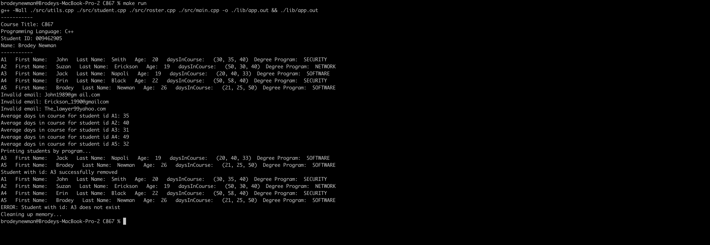

# C867 final

Class roster implementation using c++.

## Output proof



Using make to compile / run cpp application.

## Running the application

```bash
make run
```

The above make command uses g++ to compile the application.


## Notes:
1. This was built / tested on an M1 Macbook Pro.
2. I leveraged a callback for printing average course length. This might be an antipattern but wanted to try.

```cpp
classRoster->forEach(&printAverageDaysInCourseForStudent);
```